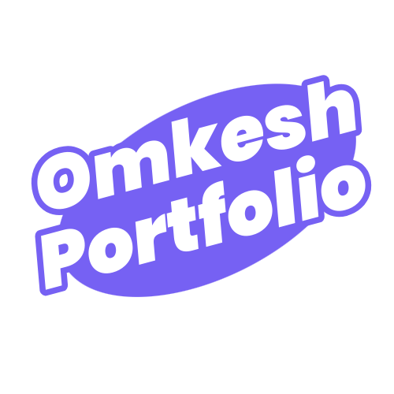

# 🌟 Omkesh Narwade - Portfolio Website

A modern, responsive portfolio website showcasing my skills, projects, and achievements as an Electronics & Computer Engineering student at MIT Aurangabad.



## 🚀 Features

### ✨ **Modern Design**
- **Glass Morphism UI** with blur effects and transparency
- **Dark/Light Theme Toggle** with smooth transitions
- **Animated Star Background** with multiple layers
- **Responsive Design** optimized for all devices
- **Smooth Animations** using AOS (Animate On Scroll)

### 📱 **Mobile-First Approach**
- **Centered Logo** with increased size on mobile
- **Hamburger Menu** with smooth slide animations
- **Touch-Friendly Navigation** with large tap targets
- **Compact Mobile Menu** with white text on dark background

### 📧 **Advanced Contact Form**
- **Email Integration** using Brevo API
- **Real-time Validation** for email and mobile number
- **Automatic Confirmation Emails** to form submitters
- **Fallback mailto** system if API fails
- **Professional Email Templates** with website branding

### 🎯 **Sections Included**
- **Hero Section** with typing animation and floating elements
- **About Me** with detailed information and statistics
- **Skills & Technologies** with animated progress bars
- **Projects Showcase** with detailed documentation
- **Education Timeline** with academic achievements
- **Certificates & Achievements** with professional certifications
- **Languages** with proficiency levels
- **Contact Form** with validation and email integration

## 🛠️ **Technologies Used**

### **Frontend**
- **HTML5** - Semantic markup
- **CSS3** - Modern styling with custom properties
- **JavaScript (ES6+)** - Interactive functionality
- **Font Awesome** - Icons and symbols
- **Google Fonts** - Inter & JetBrains Mono typography

### **Libraries & APIs**
- **AOS (Animate On Scroll)** - Scroll animations
- **Brevo API** - Email service integration
- **Custom JavaScript** - Form validation and interactions

### **Design Features**
- **CSS Grid & Flexbox** - Modern layout systems
- **CSS Custom Properties** - Theme management
- **Backdrop Filter** - Glass morphism effects
- **CSS Animations** - Smooth transitions and effects

## 📁 **Project Structure**

```
portfolio-website/
├── assets/
│   ├── css/
│   │   ├── styles.css              # Main stylesheet
│   │   ├── skills-animations.css   # Skills animations
│   │   └── skills-growth.css       # Skills growth effects
│   ├── js/
│   │   ├── main.js                 # Main JavaScript functionality
│   │   └── email-handler.js        # Email form handling
│   └── images/
│       ├── logo.png                # Website logo
│       ├── profile.jpg             # Profile picture
│       ├── photoshop.png           # Adobe Photoshop logo
│       ├── adobe.png               # Adobe Illustrator logo
│       └── xd.png                  # Adobe XD logo
├── games/
│   └── flappy-bird.html            # Flappy Bharat game
├── projects/
│   └── info/                       # Project documentation
├── index.html                      # Main homepage
├── skills.html                     # Skills & technologies page
├── projects.html                   # Projects showcase page
├── certificates.html               # Certificates & achievements page
├── resume.html                     # Resume page
├── README.md                       # Project documentation
└── .gitignore                      # Git ignore file
```

## 🎨 **Design System**

### **Color Palette**
- **Primary**: `#6366f1` (Indigo)
- **Secondary**: `#8b5cf6` (Purple)
- **Accent**: `#ec4899` (Pink)
- **Success**: `#10b981` (Emerald)
- **Error**: `#ef4444` (Red)

### **Typography**
- **Primary Font**: Inter (300, 400, 500, 600, 700)
- **Monospace Font**: JetBrains Mono (400, 500, 600)

### **Breakpoints**
- **Mobile**: `< 768px`
- **Tablet**: `768px - 1024px`
- **Desktop**: `> 1024px`

## 📧 **Contact Form Features**

### **Validation Rules**
- **Name**: Letters only, minimum 2 characters
- **Email**: Valid email format with proper domain
- **Mobile**: International format support, minimum 10 digits
- **Subject**: Minimum 3 characters
- **Message**: Minimum 10 characters

### **Email Integration**
- **Service**: Brevo API for reliable email delivery
- **Features**: 
  - Sends form data to omkeshnarwade9@gmail.com
  - Automatic confirmation email to form submitter
  - Professional HTML email templates
  - Fallback mailto system

## 🚀 **Getting Started**

### **Prerequisites**
- Modern web browser (Chrome, Firefox, Safari, Edge)
- Internet connection for external resources
- Web server for local development (optional)

### **Installation**

1. **Clone the repository**
   ```bash
   git clone https://github.com/omkesh360/portfolio-website.git
   cd portfolio-website
   ```

2. **Open in browser**
   - Simply open `index.html` in your web browser
   - Or use a local server like Live Server in VS Code

3. **For development**
   - Use VS Code with Live Server extension
   - Or use Python: `python -m http.server 8000`
   - Or use Node.js: `npx serve .`

## 🌐 **Live Demo**

Visit the live website: [Your GitHub Pages URL will go here]

## 📱 **Mobile Features**

- **Responsive Design** - Works perfectly on all screen sizes
- **Touch Gestures** - Optimized for mobile interactions
- **Fast Loading** - Optimized images and efficient code
- **PWA Ready** - Can be installed as a mobile app

## 🎮 **Interactive Elements**

- **Typing Animation** in hero section
- **Floating Icons** around profile picture
- **Animated Progress Bars** for skills
- **Hover Effects** on cards and buttons
- **Smooth Scrolling** between sections
- **Theme Toggle** with smooth transitions

## 📊 **Performance**

- **Optimized Images** - Compressed for fast loading
- **Minified CSS** - Reduced file sizes
- **Efficient JavaScript** - Clean, optimized code
- **Mobile-First** - Fast loading on mobile devices

## 🔧 **Customization**

### **Changing Colors**
Edit CSS custom properties in `assets/css/styles.css`:
```css
:root {
    --accent-primary: #your-color;
    --accent-secondary: #your-color;
}
```

### **Adding New Sections**
1. Add HTML structure in `index.html`
2. Add corresponding styles in `assets/css/styles.css`
3. Add JavaScript functionality if needed

### **Email Configuration**
Update email settings in `assets/js/email-handler.js`:
```javascript
this.recipientEmail = 'your-email@gmail.com';
this.apiKey = 'your-brevo-api-key';
```

## 📞 **Contact Information**

- **Email**: omkeshnarwade9@gmail.com
- **Phone**: +91 8830 148125
- **LinkedIn**: [linkedin.com/in/omkesh-narwade-6138a5237](https://linkedin.com/in/omkesh-narwade-6138a5237)
- **GitHub**: [github.com/omkesh360](https://github.com/omkesh360)
- **Instagram**: [instagram.com/mortal_omkesh360](https://instagram.com/mortal_omkesh360)

## 🎓 **About Me**

Electronics & Computer Engineering student at MIT Aurangabad, passionate about web development, digital marketing, and creating innovative solutions. Always eager to learn new technologies and contribute to meaningful projects.

## 📄 **License**

This project is open source and available under the [MIT License](LICENSE).

## 🙏 **Acknowledgments**

- **Font Awesome** for beautiful icons
- **Google Fonts** for typography
- **AOS Library** for scroll animations
- **Brevo** for email service
- **Inspiration** from modern web design trends

---

**Made with ❤️ by Omkesh Narwade**

*If you like this project, please give it a ⭐ on GitHub!*